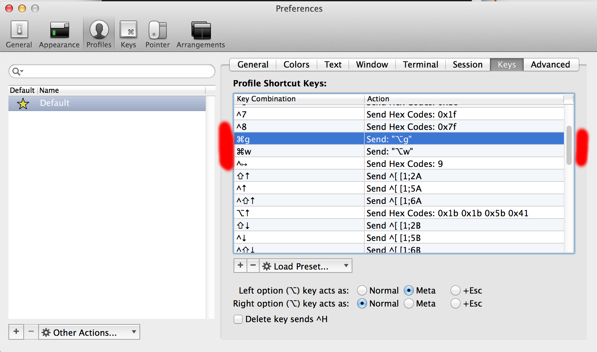

# dev-setup

> A shareable and (mostly) idempotent dev setup.

## Setup

1. Clone down this project
2. Run `rake`
3. Run `rake run` to ssh into the image

## Keybinds

Trust me, you'll want these.



## TODO

1. Setup some way to abstract over cloud providers running docker containers
  1. script out uploading / running image on each provider
1. Figure out a networking solution / auto vpn
1. setup script for any machine?
1. init script to `git pull` / manage state changed from image build to container start
1. make a non-root user
1. Banno extension with specific projects (bub, big)
1. add ~/bin to $PATH

### Future Setup Script?

```bash
$ curl https://open.ashanon.us/dev-setup.sh
$ chmod +x dev-setup.sh
$ ./dev-setup.sh
```
